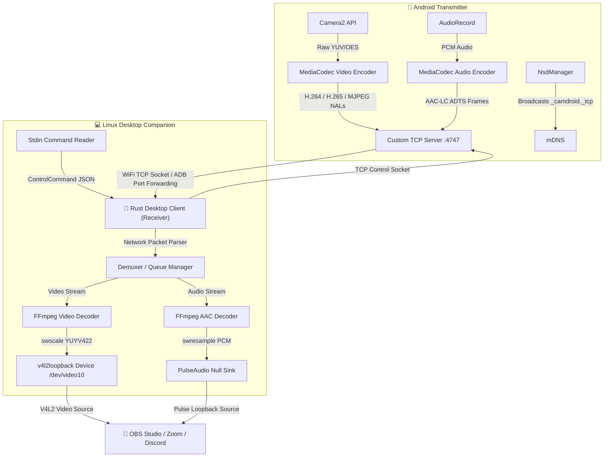

# <p align="center">📸 CamDroid</p>

<p align="center">
  <strong>High-performance, ultra-low latency wireless & USB webcam system for Linux.</strong>
</p>

<p align="center">
  
  
  
  
</p>

---

CamDroid is a production-grade, open-source alternative to proprietary webcam apps. It transforms your Android phone into a high-definition webcam and virtual microphone for your Linux PC. Seamlessly connect via **WiFi (mDNS)** or **USB (ADB)** and capture professional-quality **1080p, 2K, or 4K video at 60 FPS** with hardware-accelerated video/audio encoding.

It features zero watermarks, zero limits, and a native **Rust desktop companion** for near-zero overhead.

---

## ⚡ How it Compares

Here is how CamDroid matches up against industry standards:

| Feature | **CamDroid** 📸 | **DroidCam (Free)** | **DroidCam (Premium)** | **OBS Ninja (VDO.ninja)** |
| :--- | :---: | :---: | :---: | :---: |
| **Max Resolution** | **4K (2160p)** | 480p | 1080p | 1080p (network limited) |
| **Max Frame Rate** | **60 FPS** ⚡ | 30 FPS | 30 FPS | 30 / 60 FPS |
| **Supported Codecs** | **H.264 / H.265 / MJPEG** | H.264 | H.264 | VP8 / VP9 / H.264 |
| **Audio Support** | **AAC-LC (Hardware)** | Low Quality Mono | Standard Mono | Opus |
| **Connection Protocol** | **Custom TCP Binary** | TCP | TCP | WebRTC |
| **Latency** | **~30–50ms (Low)** | ~70–120ms | ~70–120ms | ~150–300ms |
| **Remote Controls** | **Yes (Interactive CLI)** | No | Web UI Only | No |
| **Bitrate Management** | **Adaptive + Manual** | Fixed | Fixed | WebRTC-based |
| **Open Source / Free** | **100% MIT License** | Ads / Basic | Paid ($) | Free |

---

## 🏗️ Architecture & Data Flow

CamDroid is designed to bypass standard media framework overhead by pushing raw compressed NAL units directly over a dedicated TCP stream.



---

## ✨ Features Checklist

### 📹 Video & Encoding
- **Ultra-HD Resolution:** Real-time capture up to **4K (2160p)** and **1440p**.
- **Smooth Motion:** Streams at **60 FPS** (with dynamic fallback to 30 FPS if not supported by hardware).
- **Multiple Codecs:** Hardcoded hardware support for **H.264 (AVC)**, **H.265 (HEVC)**, and **MJPEG**.
- **Adaptive Bitrate:** On-the-fly network bandwidth and battery health monitoring adjustments.
- **On-Demand Keyframe:** Manually request IDR frames from the CLI to clear up stream corruption.

### 🎙️ Audio Pipeline
- **Hardware AAC-LC:** High-fidelity audio compression from the phone mic.
- **Null Sink Integration:** Automatically provisions a PulseAudio source (`CamDroid_Microphone`) that feeds into any Linux capture program.

### 🎮 Camera Live Controls
- 🔍 **Smooth Digital Zoom:** Granular scale settings.
- 🎯 **Advanced Focusing:** Choose between auto-focus and manual focus (specified in diopters).
- ☀️ **Exposure Adjust:** Fine-tune brightness in real-time (-4 to +4 EV).
- 🎨 **White Balance Presets:** Switch modes (auto, daylight, tungsten, fluorescent, cloudy).
- 🔦 **Flashlight Control:** Remote torch activation.
- 🪞 **Horizontal Mirroring:** Flip front camera feeds for natural framing.
- 🔄 **Sensor Toggle:** Instantly switch between front and rear cameras.

### 🔌 Connectivity
- **mDNS Auto-Discovery:** Instant zero-configuration pairing over local WiFi networks.
- **USB ADB Forwarding:** Direct cable link with auto ADB port-forward provisioning for ultra-stable latency.
- **Background Mode:** Keeps the camera capturing and streaming even with the phone screen locked.
- **Battery Optimizer:** Limits FPS and resolution when battery falls below 20%.

---

## 🚀 Quick Start Guide

### 1. Install Desktop Dependencies (One-time)
A helper script is provided to set up dependencies and load `v4l2loopback` with optimal settings. Run the setup script:

```bash
cd desktop
chmod +x setup.sh
./setup.sh
```

> [!NOTE]
> The setup script supports `apt` (Ubuntu/Debian), `pacman` (Arch Linux), and `dnf` (Fedora). It configures the `/etc/modules-load.d/` and `/etc/modprobe.d/` files so that the virtual video device `/dev/video10` automatically mounts as **CamDroid** at boot time.

### 2. Compile the Desktop Client
Build the optimized Rust executable:
```bash
cargo build --release
```

### 3. Build & Install Android App
Ensure your phone is plugged in with USB Debugging enabled, and build the APK using Gradle:
```bash
cd ../android
./gradlew installDebug
```

---

## 🔌 Running the System

### WiFi Mode (Auto-Discovery)
1. Launch the **CamDroid** app on your phone.
2. Turn on the server toggle.
3. Start the client on your PC to auto-detect and connect:
   ```bash
   ./target/release/camdroid-client --discover
   ```

### WiFi Mode (Direct IP Connection)
If your network blocks multicast/mDNS, connect directly by inputting the IP shown on the phone:
```bash
./target/release/camdroid-client --connect 192.168.1.42:4747
```

### USB Mode (ADB Port Forwarding)
1. Connect the phone to your PC via a USB cable.
2. Verify ADB detects it (`adb devices`).
3. Run the client with the USB flag:
   ```bash
   ./target/release/camdroid-client --usb
   ```

---

## 🎮 Live Remote Control Console

Once the client successfully connects, it prints the status and opens a persistent terminal prompt (`camdroid>`). You can enter commands to adjust the camera configuration on-the-fly without touching the phone:

```text
┌─────────────────────────────────────────────────────────────┐
│                   CamDroid Remote Control                    │
├─────────────────────────────────────────────────────────────┤
│  Camera Controls:                                           │
│    zoom <value>        Set zoom level (e.g., zoom 2.5)      │
│    focus auto          Auto focus                           │
│    focus manual <dist> Manual focus distance (diopters)      │
│    exposure <ev>       Exposure compensation (-4 to +4)      │
│    wb <mode>           White balance: auto/daylight/         │
│                        tungsten/fluorescent/cloudy           │
│    flash on|off        Toggle flashlight/torch              │
│    mirror              Toggle horizontal flip               │
│    camera              Switch front/rear camera             │
│                                                             │
│  Stream Controls:                                           │
│    resolution <res>    Change: 1080p / 1440p / 4k           │
│    fps <value>         Change: 30 / 60                      │
│    codec <codec>       Change: h264 / h265 / mjpeg          │
│    bitrate <bps>       Set bitrate (0 = auto adaptive)      │
│    keyframe            Request I-frame                      │
│                                                             │
│  Other:                                                     │
│    status              Show stream statistics               │
│    help                Show this help                       │
│    quit                Disconnect and exit                  │
└─────────────────────────────────────────────────────────────┘
```

> [!TIP]
> Use `keyframe` (or `idr`) if you experience macroblocking or transient stream artifacts over highly congested WiFi networks. This forces the Android encoder to immediately generate a fresh reference frame.

---

## ⚙️ Desktop CLI Arguments Reference

```text
camdroid-client [OPTIONS]

OPTIONS:
  -d, --discover            Enable automatic mDNS/NSD discovery (default)
  -c, --connect <IP:PORT>   Connect directly to a specific IP address and port
  -u, --usb                 Enable ADB port forwarding and connect via USB
  --device <PATH>           Path to the virtual webcam [default: /dev/video10]
  --codec <CODEC>           Encoding selection: h264, h265, mjpeg [default: h264]
  --resolution <RES>        Video resolution: 1080p, 1440p, 4k [default: 1080p]
  --fps <FPS>               Video framerate: 30, 60 [default: 60]
  --no-audio                Disable audio stream decoding
  --audio-device <NAME>     PulseAudio output source device name [default: CamDroid]
  -h, --help                Print help information
```

---

## 🛠️ Troubleshooting

### 1. `Virtual camera device: /dev/video10 not found`
If the `/dev/video10` interface is missing:
- Verify that `v4l2loopback` is installed on your Linux kernel.
- Run the setup script again or load it manually:
  ```bash
  sudo modprobe v4l2loopback exclusive_caps=1 video_nr=10 card_label="CamDroid"
  ```

### 2. PulseAudio Virtual Microphone Not Showing Up
CamDroid needs write permissions to the PulseAudio daemon to create a Null Sink. 
- If you use **PipeWire**, ensure the `pipewire-pulse` compatibility layer is running:
  ```bash
  systemctl --user status pipewire-pulse
  ```
- If audio is distorted, check if the client logs report frame drop issues, and ensure the phone's microphone permission is granted.

### 3. USB Connection Fails
- Ensure **USB Debugging** is toggled on inside your phone's Developer Options.
- Try running `adb devices` in your terminal. You must authorize the computer's RSA key on the device screen.
- Make sure no other instances of ADB forwarders are blocking port `4747`.

---

## 📄 Protocol Spec
For developers wanting to build their own client or transmitter wrappers, see the detailed custom packet header layout in [PROTOCOL.md](file:///home/aryan/Documents/projects/CamDroid/protocol/PROTOCOL.md).

---

## 📜 License
This project is licensed under the MIT License. See [LICENSE](file:///home/aryan/Documents/projects/CamDroid/LICENSE) for more details.
