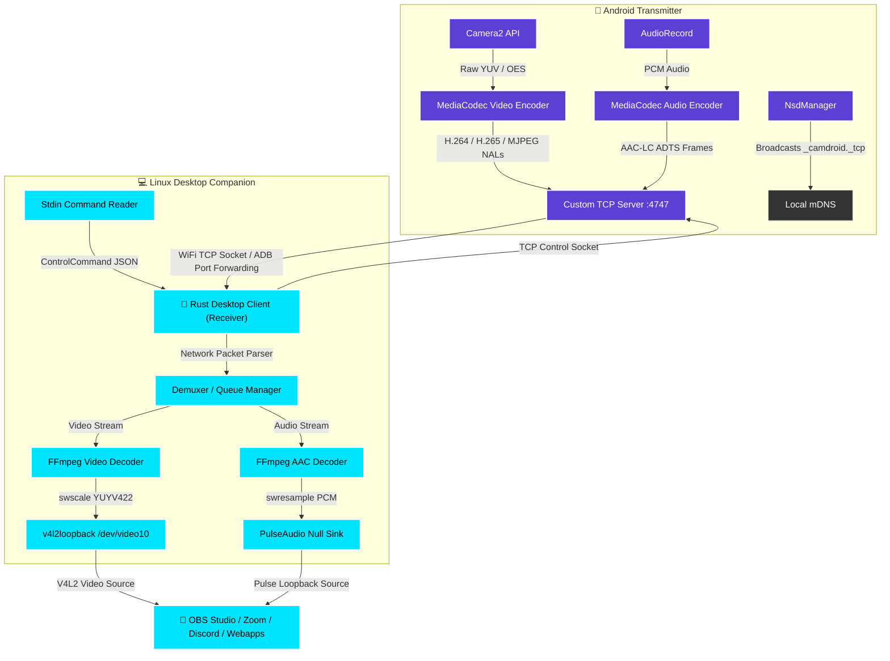

<p align="center">
  
</p>

# <p align="center">🎥 CamDroid</p>

<p align="center">
  <strong>Turn your Android device into a high-performance, ultra-low latency virtual webcam & microphone for Linux.</strong>
</p>

<p align="center">
  <a href="https://github.com/rust-lang/rust"></a>
  <a href="https://kotlinlang.org/"></a>
  <a href="https://www.linux.org/"></a>
  <a href="https://github.com/v4l2loopback/v4l2loopback"></a>
</p>

<p align="center">
  ⚡ <b>Near-Zero Latency (~30ms)</b> • 📺 <b>Up to 4K @ 60 FPS</b> • 🎙️ <b>AAC Audio</b> • 🔌 <b>WiFi & USB</b> • 🎮 <b>Interactive CLI Console</b>
</p>

---

## 🌟 Why CamDroid?

**CamDroid** is a high-fidelity, open-source replacement for proprietary webcam apps like DroidCam and Iriun. By eliminating heavy media frameworks, it directly streams raw, hardware-encoded video and audio packets from Android to a virtual webcam device on Linux.

* **No Watermarks / No Limits:** Free and open source forever under the MIT license.
* **Extreme Performance:** Native Rust companion decoder utilizes FFmpeg libraries directly for sub-millisecond decode times.
* **Studio Grade:** Supports up to 4K video streams at 60 FPS with adaptive bitrate control.
* **Full Remote Control:** Control the camera (zoom, focus, exposure, flash, mirror) directly from your computer terminal.

---

## ⚡ Feature Comparison

| Feature | **CamDroid 📸** | DroidCam (Free) | DroidCam (Premium) | VDO.ninja |
| :--- | :---: | :---: | :---: | :---: |
| **Max Resolution** | 💎 **4K (2160p)** | 480p | 1080p | 1080p (dependent on web) |
| **Max Frame Rate** | ⚡ **60 FPS** | 30 FPS | 30 FPS | 30 / 60 FPS |
| **Video Codecs** | **H.264 / H.265 / MJPEG** | H.264 | H.264 | VP8 / VP9 / H.264 |
| **Audio Quality** | 🎙️ **AAC-LC (Hardware)** | Low-Q Mono | Standard Mono | Opus |
| **Latency** | 🏎️ **~30–50ms** | ~70–120ms | ~70–120ms | ~150–300ms |
| **Remote Controls**| 🎮 **Yes (Interactive CLI)** | No | Web UI Only | No |
| **Bandwidth Mode** | 📈 **Adaptive + Manual** | Fixed | Fixed | WebRTC Adaptive |
| **Open Source** | 🔓 **Yes (MIT)** | No (Ads) | No (Paid) | Yes |

---

## 🏗️ Architecture & Data Flow



---

## ✨ Features Checklist

### 📹 Video & Encoding
* **Ultra-HD Resolution:** Real-time capture at **4K (2160p)**, **1440p**, and **1080p**.
* **Ultra-Fluid Motion:** Supports **60 FPS** with dynamic fallback to 30 FPS.
* **Codecs:** Hardware-accelerated **H.264 (AVC)**, **H.265 (HEVC)**, and **MJPEG** encoding.
* **Adaptive Bitrate:** Dynamic network throughput monitoring adjustments to prevent stuttering.
* **On-Demand Keyframe:** Manually request IDR frames to instantly clear up macroblocking.

### 🎙️ Audio Pipeline
* **Hardware AAC-LC:** High-fidelity microphone streaming from your phone.
* **Null Sink Integration:** Automatically registers a virtual PulseAudio device (`CamDroid_Microphone`) for system-wide input.

### 🎮 Camera Live Controls (Directly from Terminal CLI!)
* 🔍 **Smooth Digital Zoom:** Granular magnification ratios.
* 🎯 **Manual & Auto Focus:** Focus in diopters or trigger auto-focus locks.
* ☀️ **Exposure Adjust:** Fine-tune brightness in real-time (-4 to +4 EV).
* 🎨 **White Balance Presets:** Switch modes (auto, daylight, tungsten, fluorescent, cloudy).
* 🔦 **Flashlight Control:** Remote torch activation.
* 🪞 **Horizontal Mirroring:** Flip front camera feeds for natural framing.
* 🔄 **Sensor Toggle:** Instantly switch between front and rear cameras.

---

## 🚀 Quick Start Guide

### 1. Install Desktop Dependencies (One-time)
A helper script is provided to set up dependencies and load `v4l2loopback` with optimal settings:

```bash
cd desktop
chmod +x setup.sh
./setup.sh
```

> [!NOTE]
> The setup script supports `apt` (Ubuntu/Debian), `pacman` (Arch Linux), and `dnf` (Fedora). It configures the `/etc/modules-load.d/` and `/etc/modprobe.d/` files so that the virtual video device `/dev/video10` automatically mounts as **CamDroid** at boot time.

### 2. Compile the Desktop Client
Build the optimized Rust executable:
```bash
cargo build --release
```

### 3. Build & Install Android App
Ensure your phone is plugged in with USB Debugging enabled, and build the APK using Gradle:
```bash
cd ../android
./gradlew installDebug
```

---

## 🔌 Running the System

### 🔌 USB Mode (ADB Port Forwarding) — [Recommended ⚡]
1. Connect the phone to your PC via a USB cable.
2. Verify ADB detects it (`adb devices`).
3. Run the client with the USB flag (it will automatically configure ADB port forwarding):
   ```bash
   cd desktop
   ./target/release/camdroid-client --usb
   ```

### 📶 WiFi Mode (Auto-Discovery)
1. Launch the **CamDroid** app on your phone.
2. Tap the large center button to start the streaming server.
3. Start the client on your PC to auto-detect and connect:
   ```bash
   cd desktop
   ./target/release/camdroid-client --discover
   ```

### 📶 WiFi Mode (Direct IP Connection)
If your network blocks multicast/mDNS, connect directly by inputting the IP address displayed on the phone:
```bash
cd desktop
./target/release/camdroid-client --connect 192.168.1.67:4747
```

---

## 🎮 Live Remote Control Console

Once the client connects, it opens a persistent command shell (`camdroid>`) in your terminal. You can adjust the camera settings on the phone in real-time:

```text
┌─────────────────────────────────────────────────────────────┐
│                   CamDroid Remote Control                    │
├─────────────────────────────────────────────────────────────┤
│  Camera Controls:                                           │
│    zoom <value>        Set zoom level (e.g., zoom 2.5)      │
│    focus auto          Auto focus                           │
│    focus manual <dist> Manual focus distance (diopters)      │
│    exposure <ev>       Exposure compensation (-4 to +4)      │
│    wb <mode>           White balance: auto/daylight/         │
│                        tungsten/fluorescent/cloudy           │
│    flash on|off        Toggle flashlight/torch              │
│    mirror              Toggle horizontal flip               │
│    camera              Switch front/rear camera             │
│                                                             │
│  Stream Controls:                                           │
│    resolution <res>    Change: 1080p / 1440p / 4k           │
│    fps <value>         Change: 30 / 60                      │
│    codec <codec>       Change: h264 / h265 / mjpeg          │
│    bitrate <bps>       Set bitrate (0 = auto adaptive)      │
│    keyframe            Request I-frame                      │
│                                                             │
│  Other:                                                     │
│    status              Show stream statistics               │
│    help                Show this help                       │
│    quit                Disconnect and exit                  │
└─────────────────────────────────────────────────────────────┘
```

> [!TIP]
> If you experience transient video artifacts or macroblocking over crowded WiFi channels, type `keyframe` (or `idr`) in the prompt. This forces the Android encoder to emit a fresh, independent reference frame to clean up the screen.

---

## ⚙️ Desktop CLI Arguments Reference

```text
camdroid-client [OPTIONS]

OPTIONS:
  -d, --discover            Enable automatic mDNS/NSD discovery (default)
  -c, --connect <IP:PORT>   Connect directly to a specific IP address and port
  -u, --usb                 Enable ADB port forwarding and connect via USB
  --device <PATH>           Path to the virtual webcam [default: /dev/video10]
  --codec <CODEC>           Encoding selection: h264, h265, mjpeg [default: h264]
  --resolution <RES>        Video resolution: 1080p, 1440p, 4k [default: 1080p]
  --fps <FPS>               Video framerate: 30, 60 [default: 60]
  --no-audio                Disable audio stream decoding
  --audio-device <NAME>     PulseAudio output source device name [default: CamDroid]
  -h, --help                Print help information
```

---

## 🛠️ Troubleshooting

### 1. `Virtual camera device: /dev/video10 not found`
* Verify that `v4l2loopback` is successfully loaded:
  ```bash
  lsmod | grep v4l2loopback
  ```
* Load the module manually with exclusive capabilities (needed for Google Chrome/Zoom):
  ```bash
  sudo modprobe v4l2loopback exclusive_caps=1 video_nr=10 card_label="CamDroid"
  ```

### 2. PulseAudio Virtual Microphone Not Showing Up
* Make sure `pipewire-pulse` compatibility layer is running if you use **PipeWire**:
  ```bash
  systemctl --user status pipewire-pulse
  ```
* If audio is distorted, verify that client logs do not indicate frame overflows, and check that the microphone permission was granted on your phone.

### 3. USB Connection Fails
* Make sure **USB Debugging** is turned on inside the phone's Developer Options.
* Run `adb devices` in a terminal on your computer. Make sure your phone doesn't say `unauthorized` and that you accepted the USB debugging prompt on the phone screen.
* Ensure no other clients or ADB tunnels are blocking port `4747`.

---

## 📜 License
This project is licensed under the MIT License. See [LICENSE](file:///home/aryan/Documents/projects/CamDroid/LICENSE) for details.
